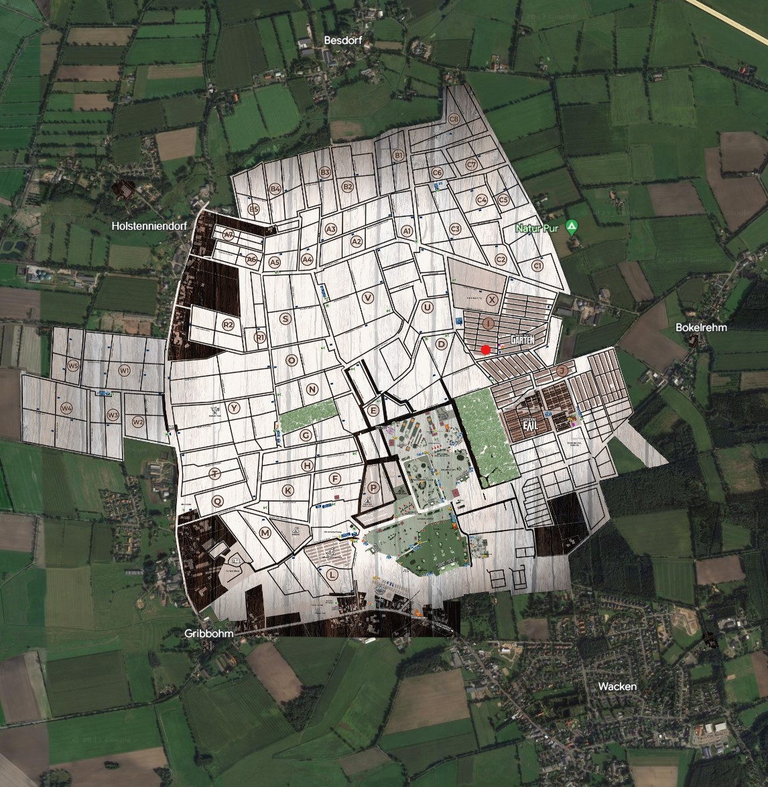
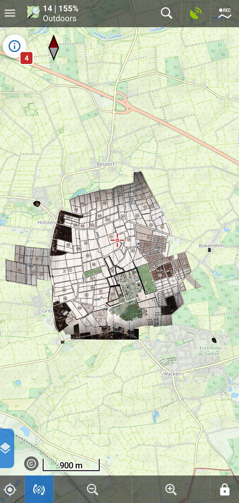

# WackenMaps
Overlay for mapping system for the Wacken Open Air W:O:A

## Google Earth

### How to install 

1. Download Lageplan_WOA.kmz to your computer
2. Start Google Earth in your browser https://www.google.de/intl/de/earth/index.html
3. Choose Menu > Projekte > Öffnen > KML Datei vom Computer importieren
4. Select the file from your folder

## Locus Map 3 Classic

### How to install

1. Install "Locus Map 3 Classic" on your Smartphone
2. Download Lageplan_WOA.kmz to your phone
3. Start Locus Map
4. Click the menu icon (Hamburger)
5. Choose "Weitere Funktionen" > Kartenelemente
6. Click the plus logo
7. Choose "System-Dateimanager"
8. Select the file from the Downloads directory

### Enable or Disable the overlay

You can enable or disable the overlay by checking/unchecking the eye symbol in "Kartenelement"
